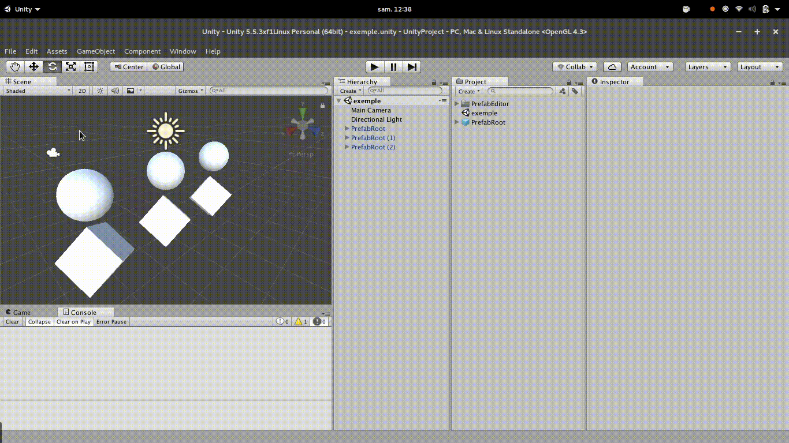

# Unity3D-PrefabEditor
Plugin unity3D to edit prefabs on separate scene.

Inspired by [forestrf/prefab-editor](https://bitbucket.org/forestrf/prefab-editor) 

## Usage
To open prefab editor, double click on a prefab file in project panel.
Current scene is save and a new empty scene with only prefab instance is create. Editor lighting is disable and prefab instance is focus.
To apply modifications juste save this tmp scene (with **Ctrl-S**).

## Screens

